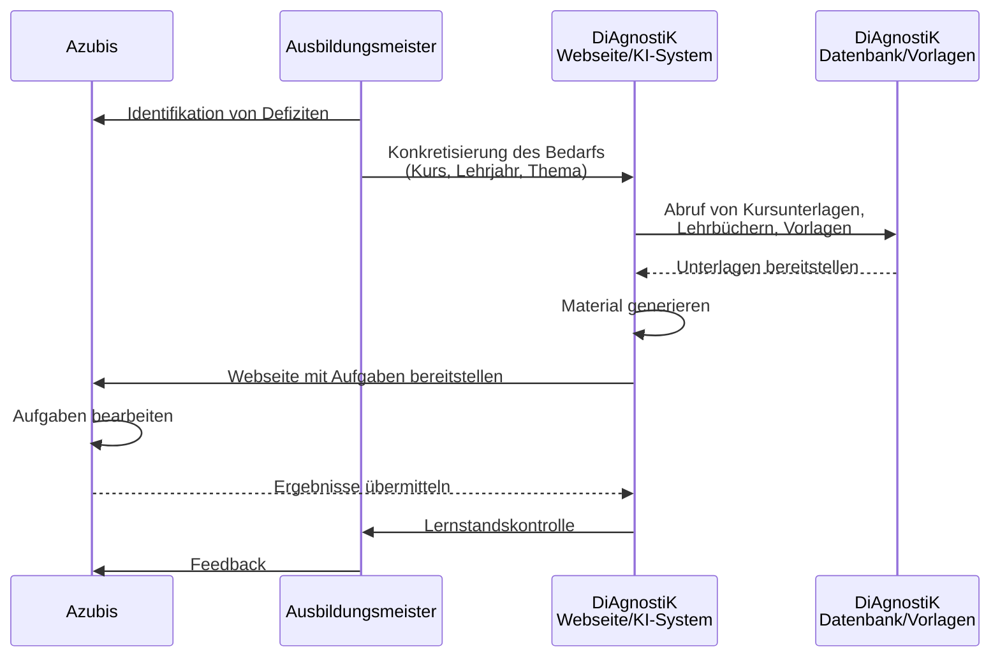
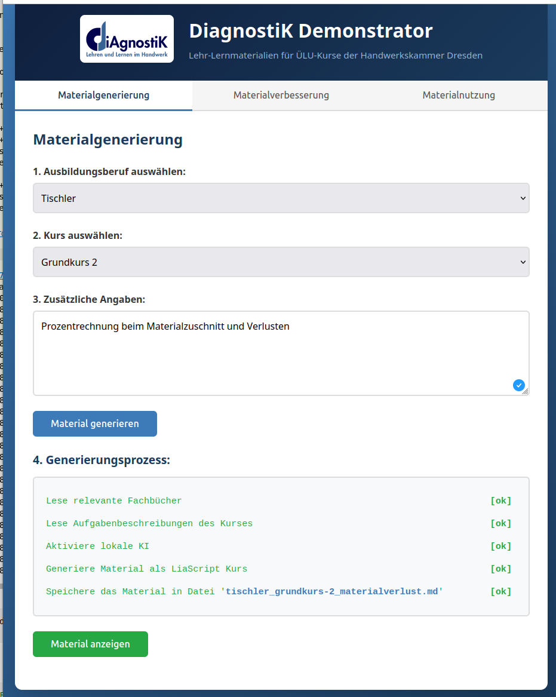

<!--
author: Sebastian Zug, Hilke Domsch, Volker Göhler, André Dietrich
version: 0.0.3
language: de
date: 2025-09-29
comment: Beiratssitzung des DiAgnostiK-Projekts am 29.09.2025
title: Runder Tisch 2025
tags: Vortrag, DiAgnostiK, Ifi
icon: ../images/Projektlogo.png
import: https://raw.githubusercontent.com/liaScript/mermaid_template/master/README.md
        https://raw.githubusercontent.com/LiaTemplates/LiveEdit-Embeddings/refs/tags/0.0.1/README.md

@style
.flex-container {
    display: flex;
    flex-wrap: wrap; /* Allows the items to wrap as needed */
    align-items: stretch;
    gap: 20px; /* Adds both horizontal and vertical spacing between items */
}

.flex-child { 
    flex: 1;
    margin-right: 20px; /* Adds space between the columns */
}

@media (max-width: 600px) {
    .flex-child {
        flex: 100%; /* Makes the child divs take up the full width on slim devices */
        margin-right: 0; /* Removes the right margin */
    }
}
@end

-->

[](https://liascript.github.io/course/?https://raw.githubusercontent.com/Ifi-DiAgnostiK-Project/Diagnostik_Presentations/refs/heads/main/13112025_RunderTisch/presentation.md#1)

# KI als Werkzeug zur Generierung von Aufgaben in der beruflichen Bildung

<section class="flex-container">

<!-- class="flex-child" style="min-width: 250px;" -->
> <h2>Stand der Arbeiten an der TU Bergakademie Freiberg</h2>
> 
> Prof. Dr. Sebastian Zug
> 
> Dr. André Dietrich
> 
> Volker Göhler
>
><h4>Runder Tisch Digitale Berufliche Bildung am 13.11.2025</h4>

<!-- class="flex-child" style="min-width: 250px;" -->


</section>

## Vision von DiAgnostiK

> __Unterstützung der ÜLU-Unterweisungen durch KI-generierte Aufgaben__

{{0-1}}


{{1-2}}


## Warum LiaScript?

> LiaScript ist eine **Beschreibungssprache** für interaktive Lerninhalte, die auf Markdown basiert und durch spezielle Erweiterungen ergänzt wird. Der entscheidende Vorteil liegt in der Möglichkeit, diese Dokumente durch eine KI generieren zu lassen.

```markdown @embed.style(height: 550px; min-width: 100%; border: 1px black solid)
# KIs mögen Textdateien

<!-- data-show="true" -->
| Fläche (Quadratmeter) | Kosten (Euro) |
|-----------------------|:-------------:|
| 1                     |           200 |
| 4                     |           500 |

Welche Kosten müssen Sie für 3 Quadratmeter veranschlagen?

[[ 400 ]] Euro
```

## Technisch / Methodische Herausforderungen

1. __Technische Randbedingungen während der ÜLU-Kurse__

   > _Jeder nimmt sich bitte einen Laptop ..._ ❌

2. __Heterogene digitale Vorkenntnisse bei Azubis und Lehrenden__

   > _Schauen Sie sich das Video an und beantworten Sie das zugehörige Quiz ..._ ❌

3. __Konkretisierung der allgemeinen/fachpraktischen Inhalte__

   > _KI, entnimm Formate prüfungsrelevanter Aufgaben aus Lehrbüchern, Aufgaben zur Prüfung, etc. ..._ ❌

4. __Qualität der Inhalte__

   > _Aber gern. Ich generiere Dir eine Aufgabe, die die Holzarten im Tischlerhandwerk behandelt ..._ ❌

5. __Einbettung in bestehende IT-Infrastrukturen__

   > _..._ ❌

## Lösungsstrategie

> Um die übergreifende Herausforderung der KI-gestützten Generierung von Aufgaben zu bewältigen, wird ein hybrider Ansatz verfolgt, der den Einsatz von KI-generierten Materialien mit manuell erzeugten Inhalten vorbereitet.

Manuell erzeugte Inhalte
--------------------------

Beispiele für manuell erstellte Inhalte finden sich unter 

https://ifi-diagnostik-project.github.io/LiaScript-Courses/

> Gegenwärtig laufen erste Tests zur Einbindung und Evaluation von digitalen Materialien in die ÜLU-Kurse der HWK Dresden.  

KI-gestützte Erzeugung
--------------------------

1. Datenerfassung für die Kontextualisierung der Aufgabenstellung (abgeschlossen)
2. Entwurf eines dialoggeführten Systems zur Generierung der Aufgaben (in Arbeit)
3. Implementierung der Lernumgebung mit generierten Materialien (geplant)

   ```
   🎓 Teaching-Agent aktiviert.
   Ich bleibe **streng in Charakter** und folge den BMAD-Bundle Instruktionen.
   
   📌 Nächster Schritt gemäß den Instruktionen: **Immer zuerst eine Lecture Outline erstellen.**
   Dafür brauche ich von dir:
   
   * Titel der Vorlesung
   * Zielgruppe
   * Abstract (Themen, Inhalte, Nutzen)
   * 3–5 Lernziele
   * (Optional) Logo-Prompt
   
   👉 Möchtest du die Outline jetzt starten?
   ```

