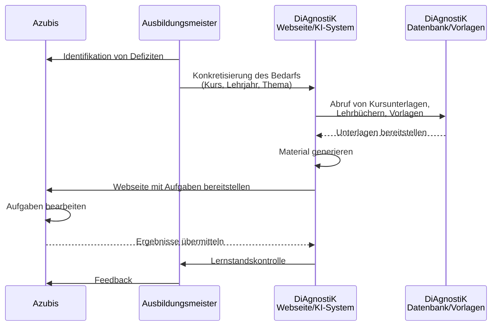

<!--
author: Sebastian Zug, Hilke Domsch, Volker Göhler, André Dietrich
version: 0.0.3
language: de
date: 2026-01-19
comment: Beiratssitzung des DiAgnostiK-Projekts am 19.01.2026
title: Runder Tisch 2026
tags: Vortrag, DiAgnostiK, Ifi
icon: ../images/Projektlogo.png
import: https://raw.githubusercontent.com/liaScript/mermaid_template/master/README.md
        https://raw.githubusercontent.com/LiaTemplates/LiveEdit-Embeddings/refs/tags/0.0.1/README.md

@style
.flex-container {
    display: flex;
    flex-wrap: wrap; /* Allows the items to wrap as needed */
    align-items: stretch;
    gap: 20px; /* Adds both horizontal and vertical spacing between items */
}

.flex-child { 
    flex: 1;
    margin-right: 20px; /* Adds space between the columns */
}

@media (max-width: 600px) {
    .flex-child {
        flex: 100%; /* Makes the child divs take up the full width on slim devices */
        margin-right: 0; /* Removes the right margin */
    }
}
@end

-->

[](https://liascript.github.io/course/?https://raw.githubusercontent.com/Ifi-DiAgnostiK-Project/Diagnostik_Presentations/refs/heads/main/19012026_Beiratssitzung/presentation.md#1)

# KI als Werkzeug zur Generierung von Aufgaben in der beruflichen Bildung

<section class="flex-container">

<!-- class="flex-child" style="min-width: 250px;" -->
> <h2>Stand der Arbeiten an der TU Bergakademie Freiberg</h2>
> 
> Prof. Dr. Sebastian Zug
> 
> Dr. André Dietrich
> 
> Volker Göhler
>
><h4>Runder Tisch Digitale Berufliche Bildung am 19.01.2026</h4>

<!-- class="flex-child" style="min-width: 250px;" -->


</section>

## Vision von DiAgnostiK

> __Unterstützung der ÜLU-Unterweisungen durch KI-generierte Aufgaben__

{{0-1}}


{{1-2}}
!?[](https://www.youtube.com/watch?v=6VE-2vbKAE8 "Prototyp zur KI-gestützten Generierung von Aufgaben im Rahmen des DiAgnostiK-Projektes.")

## Warum LiaScript?

> LiaScript ist eine **Beschreibungssprache** für interaktive Lerninhalte, die auf Markdown basiert und durch spezielle Erweiterungen ergänzt wird. Der entscheidende Vorteil liegt in der Möglichkeit, diese Dokumente durch eine KI generieren zu lassen.

```markdown @embed.style(height: 550px; min-width: 100%; border: 1px black solid)
# KIs mögen Textdateien

<!-- data-show="true" -->
| Fläche (Quadratmeter) | Kosten (Euro) |
|-----------------------|:-------------:|
| 1                     |           200 |
| 4                     |           500 |

Welche Kosten müssen Sie für 3 Quadratmeter veranschlagen?

[[ 400 ]] Euro
```

## Lösungsstrategie

> Um die übergreifende Herausforderung der KI-gestützten Generierung von Aufgaben zu bewältigen, wird ein hybrider Ansatz verfolgt, der den Einsatz von KI-generierten Materialien mit manuell erzeugten Inhalten vorbereitet.

+ Automatische Evaluation der Syntax von generierten Inhalten
+ Didaktische Evaluation der Resultate
+ Verbesserung der Änderungsmöglichkeiten