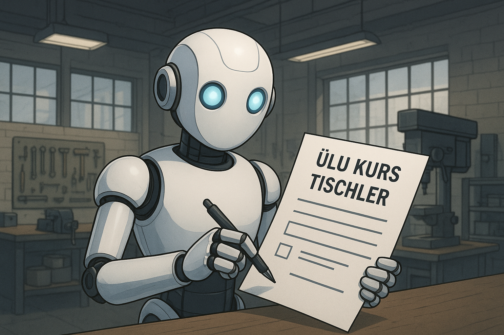
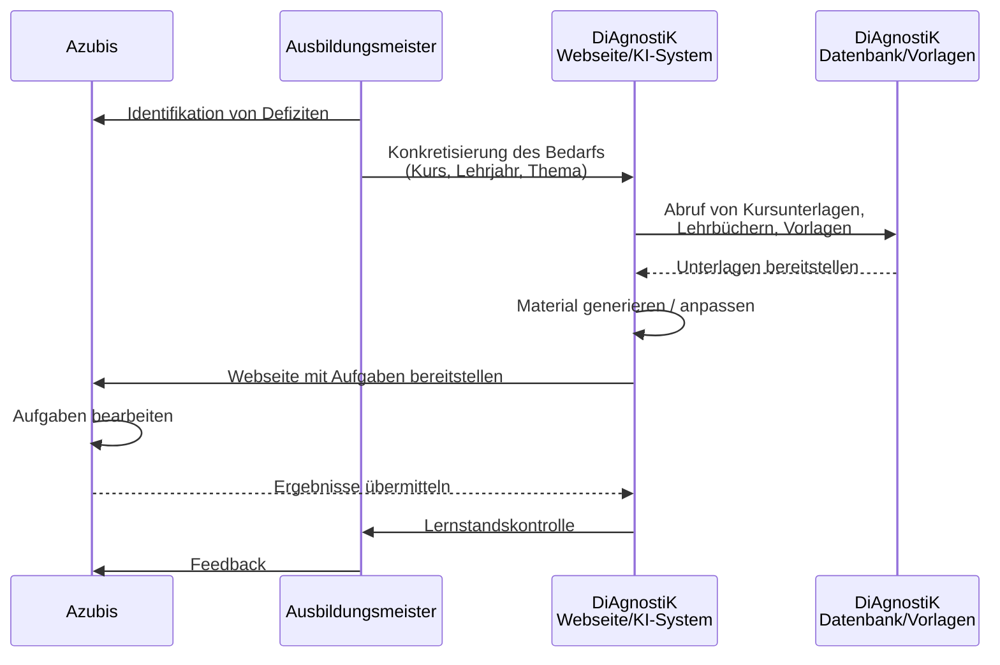

<!--
author: Sebastian Zug, Hilke Domsch, Volker Göhler, André Dietrich
version: 0.0.1
language: de
date: 2026-04-20
comment: Beiratssitzung des DiAgnostiK-Projekts am 20.04.2026
title: Beiratssitzung 04/2026
tags: Vortrag, DiAgnostiK, Ifi
icon: ../images/Projektlogo.png
import: https://raw.githubusercontent.com/liaScript/mermaid_template/master/README.md
        https://raw.githubusercontent.com/LiaTemplates/LiveEdit-Embeddings/refs/tags/0.0.1/README.md

@style
.flex-container {
    display: flex;
    flex-wrap: wrap;
    align-items: stretch;
    gap: 20px;
}

.flex-child { 
    flex: 1;
    margin-right: 20px;
}

@media (max-width: 600px) {
    .flex-child {
        flex: 100%;
        margin-right: 0;
    }
}
@end

-->

[](https://liascript.github.io/course/?https://raw.githubusercontent.com/Ifi-DiAgnostiK-Project/Diagnostik_Presentations/refs/heads/main/20042026_Beiratssitzung/presentation.md#1)

# KI in DiAgnostiK — Anwendungsfälle und Herausforderungen

<section class="flex-container">

<!-- class="flex-child" style="min-width: 250px;" -->
> <h2>Stand der Arbeiten an der TU Bergakademie Freiberg</h2>
> 
> Prof. Dr. Sebastian Zug
> 
> Dr. André Dietrich
> 
> Volker Göhler
>
> <h4>Beiratssitzung am 20.04.2026</h4>

<!-- class="flex-child" style="min-width: 250px;" -->


</section>

## Wo stehen wir?

> __Vision:__ Unterstützung der ÜLU-Unterweisungen durch KI-generierte und KI-adaptierte Aufgaben.



> Seit der letzten Beiratssitzung hat sich unser Bild davon geschärft, **wo** KI tatsächlich Mehrwert bringt — und **wo** sie mehr Aufwand erzeugt als sie spart.

## Leitfrage für heute

> __Nicht__ mehr: _"Kann KI Aufgaben generieren?"_
>
> __Sondern:__ _"Welche Formen der KI-Nutzung passen zu welchem Einsatzszenario — und welche Herausforderungen bringt jede Form mit sich?"_

Wir strukturieren die KI-Anwendung entlang **wachsender Eingriffstiefe**: von der reinen Wiederverwendung fertiger Materialien bis zur autonomen Generierung auf Basis von Lernerdaten.

## Klassifikation der KI-Anwendungsfälle

| #   | Anwendungsfall                             | Rolle der KI        | Beispiel im ÜLU-Kontext                            |
| --- | ------------------------------------------ | ------------------- | -------------------------------------------------- |
| 1   | **Nutzung fertiger Materialien**           | keine — nur Abruf   | Kurs aus kuratierter Sammlung öffnen               |
| 2   | **Selektion & Zusammenstellung**           | Retrieval / Ranking | "Finde Aufgaben zu Holzarten, 2. Lehrjahr"         |
| 3   | **Anpassung bestehender Inhalte**          | Transformation      | Sprachniveau absenken, Kontext austauschen         |
| 4   | **Generierung aus Vorlagen**               | geführte Synthese   | Quiz-Template mit neuen Aufgaben füllen            |
| 5   | **Dialoggeführte Neugenerierung**          | kooperativ          | Ausbildungsmeister ↔ Agent im Chat                 |
| 6   | **Autonome, adaptive Generierung**         | eigenständig        | System reagiert auf Bearbeitungsmuster des Azubis  |

> Je weiter unten in der Tabelle, desto mehr Gestaltungsfreiheit hat die KI — und desto kritischer wird die Qualitätssicherung.

### 1 — Nutzung fertiger Materialien ohne Anpassung

> Kuratierte LiaScript-Kurse werden unverändert im ÜLU-Kontext eingesetzt.

<section class="flex-container">

<!-- class="flex-child" style="min-width: 300px;" -->
> __Stärken__
>
> - Fachliche Qualität durch manuelle Erstellung gesichert
> - Reproduzierbar, versionierbar
> - Sofort einsetzbar

<!-- class="flex-child" style="min-width: 300px;" -->
> __Herausforderungen__
>
> - **Passung:** Treffen vorhandene Kurse genau das aktuelle Gewerk / Lehrjahr / Defizit?
> - **Auffindbarkeit:** Metadaten und Suche in wachsender Sammlung
> - **Pflegeaufwand:** Inhalte veralten (Normen, Werkstoffe, Werkzeuge)

</section>

Beispiele: https://ifi-diagnostik-project.github.io/LiaScript-Courses/

### 2 — Selektion & Zusammenstellung

> Die KI wählt aus einem Pool vorhandener Aufgaben passende Inhalte aus.

__Typischer Prompt:__
``` Prompt
Stelle aus der Sammlung 10 Aufgaben zusammen, die Arbeitszeitkalkulation
im 2. Lehrjahr Zahntechnik adressieren — gemischter Schwierigkeitsgrad.
```

__Herausforderungen__

- **Metadatenqualität:** KI kann nur finden, was korrekt verschlagwortet ist
- **Relevanzbewertung:** Semantische Ähnlichkeit ≠ didaktische Passung
- **Blindstellen:** Was nicht im Pool ist, wird nicht vorgeschlagen — ohne Warnung

### 3 — Anpassung bestehender Inhalte

> Ein Ausgangsmaterial wird durch die KI transformiert: Sprachniveau, Kontext, Schwierigkeitsgrad, Darstellungsform.

__Typischer Prompt:__
``` Prompt
Übertrage diese Aufgabe zur Flächenberechnung aus dem Tischlerhandwerk
ins Gewerk Zahntechnik — gleiche Rechenlogik, neuer Kontext.
```

__Herausforderungen__

- **Fachliche Korrektheit bleibt das Problem** — Kontextwechsel bringen subtile Fehler (falsche Einheiten, unrealistische Größenordnungen)
- **Didaktischer Kern** muss erhalten bleiben (Lernziel, Schwierigkeit)
- **Review-Aufwand** wird oft unterschätzt: "schnell anpassen" ≠ "schnell prüfen"

### 4 — Generierung aus Vorlagen

> Ein festes Template (Quiz, Lückentext, Rechnung) wird mit neuen, KI-generierten Inhalten befüllt.

```markdown @embed.style(height: 350px; min-width: 100%; border: 1px black solid)
# Arbeitszeitkalkulation

Eine Mitarbeiterin benötigt für die Herstellung einer Krone **90 Minuten**.  
Wie viele Stunden sind das?

[( )] 1 Stunde
[(X)] 1,5 Stunden
[( )] 2 Stunden
```

__Herausforderungen__

- **Template-Design** ist die eigentliche didaktische Arbeit — die KI füllt nur
- **Prompt-Engineering** ist kein Einmal-Aufwand, sondern kontinuierliche Pflege
- **Variantenvielfalt** vs. **Aufgabenqualität**: viele Aufgaben sind leicht, gute Aufgaben sind selten

### 5 — Dialoggeführte Neugenerierung

> Der Ausbildungsmeister entwickelt im Dialog mit einem Agenten konkrete Aufgaben für eine Unterweisung.

```
🎓 Teaching-Agent aktiviert.
Ich bleibe **streng in Charakter** und folge den BMAD-Bundle Instruktionen.

📌 Nächster Schritt: **Immer zuerst eine Lecture Outline erstellen.**
Dafür brauche ich von dir:

* Titel der Vorlesung
* Zielgruppe
* Abstract (Themen, Inhalte, Nutzen)
* 3–5 Lernziele

👉 Möchtest du die Outline jetzt starten?
```

__Herausforderungen__

- **UX für Nicht-KI-Expert:innen:** der Ausbildungsmeister ist kein Prompt-Engineer
- **Kontextualisierung:** wie bringt das System Lehrbuch, Rahmenlehrplan, Prüfungsformate ein?
- **Reproduzierbarkeit:** gleicher Dialog → vergleichbares Ergebnis?
- **Abbruchrisiko:** je länger der Dialog, desto höher die Abbruchquote

### 6 — Autonome, adaptive Generierung

> Das System generiert auf Basis der bisherigen Lernerdaten eigenständig die nächste Aufgabe.

__Herausforderungen — und hier wird es ernst__

- **Datenschutz:** personenbezogene Lernerdaten im KI-Kontext
- **Qualitätssicherung ohne Human-in-the-loop:** wer verantwortet eine fehlerhafte Aufgabe?
- **Vertrauen** der Ausbildungsmeister: Blackbox-Entscheidungen werden nicht akzeptiert
- **Bias & Fairness:** adaptive Systeme können Lernende auch systematisch benachteiligen

> Diese Stufe ist im DiAgnostiK-Projekt **bewusst nicht das Ziel** — wir bleiben im kooperativen Bereich (Stufen 1–5).

## Querschnittsherausforderungen

Unabhängig vom Anwendungsfall gelten:

| Herausforderung                                       | Wirkt auf Stufen |
| ----------------------------------------------------- | ---------------- |
| **Technische Randbedingungen in ÜLU-Kursen**          | 1 – 6            |
| **Heterogene digitale Vorkenntnisse** bei Azubis / AM | 1 – 6            |
| **Einbettung in bestehende IT-Infrastrukturen** (HWK) | 1 – 6            |
| **Qualitätssicherung** der Inhalte                    | 3 – 6            |
| **Prompt- & Template-Pflege**                         | 3 – 5            |
| **Datenschutz / Datenhaltung**                        | 5 – 6            |

> Der Aufwand verschiebt sich: Bei Stufe 1 liegt er in der **Erstellung**, bei Stufe 5 in der **Systementwicklung und Pflege**.

## Einordnung der aktuellen Projektarbeit

| Stufe | Arbeitsstand                                          |
| ----- | ----------------------------------------------------- |
| 1     | **Produktiv** — erste ÜLU-Tests an der HWK Dresden    |
| 2     | **In Arbeit** — Metadatenschema, Suche                |
| 3     | **Prototyp** — Kontext-Transfer zwischen Gewerken     |
| 4     | **In Arbeit** — Template-Bibliothek                   |
| 5     | **Prototyp** — dialoggeführtes System (BMAD-Agent)    |
| 6     | **Nicht im Fokus**                                    |

## Diskussion mit dem Beirat

> Welche der sechs Stufen sehen Sie aus Sicht Ihrer Einrichtung als **kurzfristig** relevant — und wo liegen aus Ihrer Sicht die **größten Akzeptanzhürden**?

__Konkrete Fragen:__

1. Passt die Klassifikation zu dem, was Sie in Ihrer Praxis beobachten?
2. An welcher Stufe würden Sie einen Pilotversuch in Ihrer Kammer ansetzen?
3. Welche Qualitätssicherung halten Sie ab Stufe 3 für unverzichtbar?
4. Welche Rolle sehen Sie für den Ausbildungsmeister in Stufe 5 — Co-Autor, Kurator, Prüfer?
