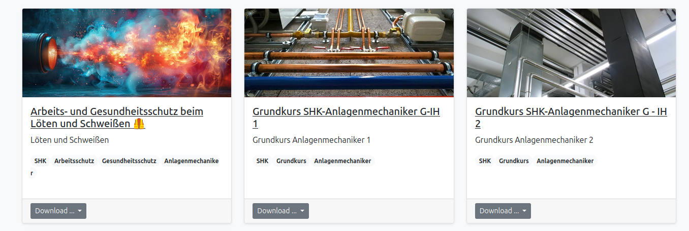
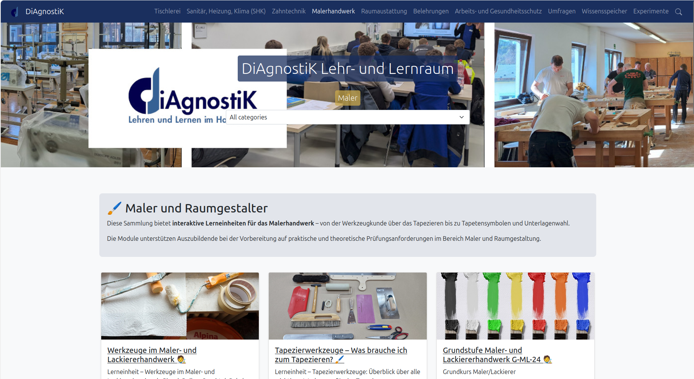
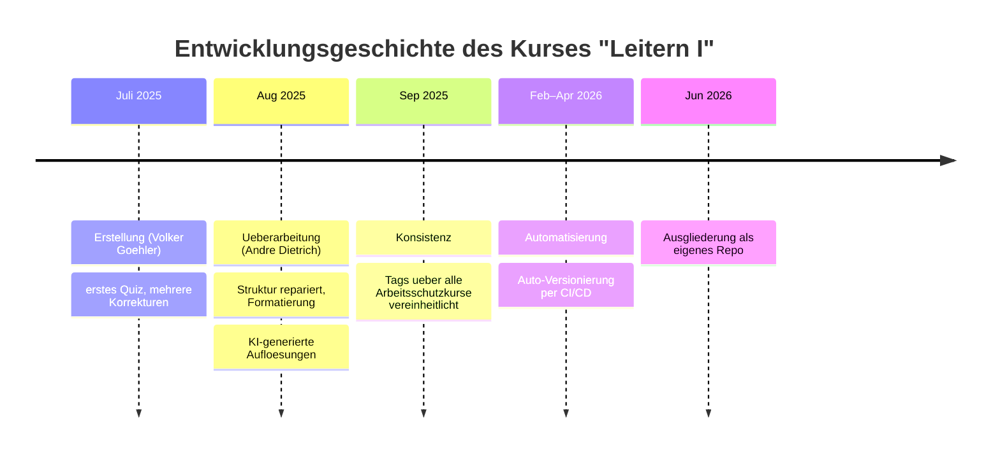
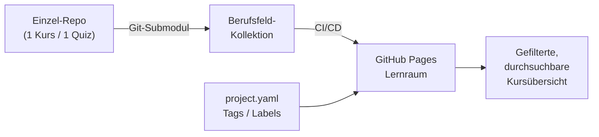
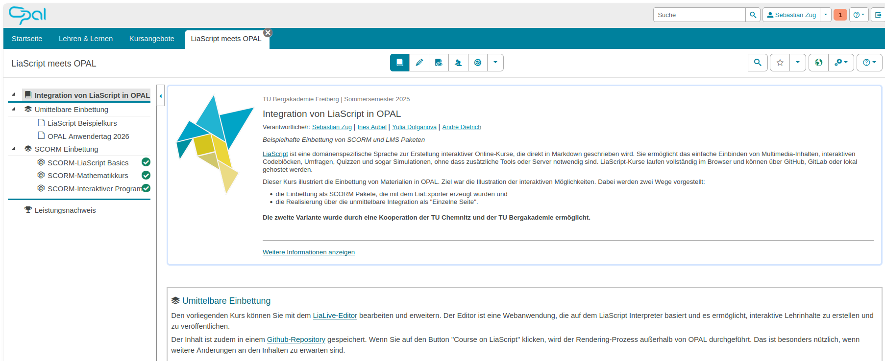

<!--
author: Sebastian Zug, Hilke Domsch, Volker Göhler, André Dietrich
version: 0.0.1
language: de
date: 2026-06-29
comment: Beiratssitzung des DiAgnostiK-Projekts am 29.06.2026
title: Beiratssitzung 06/2026
tags: Vortrag, DiAgnostiK, Ifi
icon: ../images/Projektlogo.png
import: https://raw.githubusercontent.com/liaScript/mermaid_template/master/README.md
        https://raw.githubusercontent.com/LiaTemplates/LiveEdit-Embeddings/refs/tags/0.0.1/README.md

@style
.flex-container {
    display: flex;
    flex-wrap: wrap;
    align-items: stretch;
    gap: 20px;
}

.flex-child { 
    flex: 1;
    margin-right: 20px;
}

@media (max-width: 600px) {
    .flex-child {
        flex: 100%;
        margin-right: 0;
    }
}
@end

-->

[](https://liascript.github.io/course/?https://raw.githubusercontent.com/Ifi-DiAgnostiK-Project/Diagnostik_Presentations/refs/heads/main/29062026_Beiratssitzung/presentation.md#1)

# DiAgnostiK — Beiratssitzung 06/2026

<section class="flex-container">

<!-- class="flex-child" style="min-width: 250px;" -->
> <h2>Stand der Arbeiten im DiAgnostiK-Projekt</h2>
> 
> Hilke Domsch, Heike Kirschke (GKZ)
> Prof. Dr. Sebastian Zug, Dr. André Dietrich (TU Bergakademie Freiberg)
> Florian Riefling, Anke Kaschner, Kerstin Schmid (HWK Dresden)
>
> <h4>Beiratssitzung am 29.06.2026</h4>

<!-- class="flex-child" style="min-width: 250px;" -->


</section>

## Tagesordnung

| #   | Punkt                                          | Wer            |
| --- | ---------------------------------------------- | -------------- |
| 0   | **Aktuelle Entwicklungen** (neu)               | Zug / Dietrich |
| 1   | **Stand KI**                                   | Zug            |
| 2   | **Stand LMS**                                  | Zug / Dietrich |
| 3   | **Vorbereitung Evaluierung I der Quizze**      | Zug            |
| 4   | **Sonstiges**                                  | alle           |



# 0 — Aktuelle Entwicklungen



## 2. Digitaler Runder Tisch Berufliche Bildung

> Am **28. April 2026** fand die zweite Auflage statt — mit rund **70 Vertreter:innen** aus Handwerk, Bildung, Wissenschaft und Politik.

<section class="flex-container">

<!-- class="flex-child" style="min-width: 300px;" -->
> __Schwerpunkte der Diskussion__
>
> - **KI & Arbeitswelten:** Wandel hin zu flexibleren, projektbasierten Beschäftigungsformen
> - **Individualisiertes Lernen:** digitale Lernbegleiter — bei Erhalt grundlegender Lernkompetenzen
> - **KI in Prüfungen:** Sprachmodelle zur *Unterstützung* der Prüfenden, nicht zur automatischen Bewertung

<!-- class="flex-child" style="min-width: 300px;" -->
> __Zentrale Erkenntnis__
>
> Fehlende **Schnittstellen** zwischen LMS, Berufsschulen und Betrieben behindern die effiziente digitale Nutzung.
>
> → genau hier setzen wir mit Lernraum & Klassenräumen an *(siehe TOP 2)*

</section>

> Bericht: https://uelu-digital.de/news/2-digitaler-runder-tisch-berufliche-bildung-ki-als-impulsgeber-fur-neue-lern-und-arbeitswelten/

## Aktuelle inhaltliche und technische Entwicklung

> Zwischen der Beiratssitzung am **20.04.2026** und heute (**29.06.2026**) hat sich die inhaltliche Substanz des Projekts deutlich verbreitert.

Die zentrale Entwicklung: Wir sind von **einzelnen Pilotkursen** zu einer **strukturierten, durchsuchbaren Kurssammlung** übergegangen — technisch sauber versioniert und automatisiert publiziert.

<section class="flex-container">

<!-- class="flex-child" style="min-width: 300px;" -->
> __Inhaltlich__
>
> - Neue Berufsfeld-Kollektionen
> - Quizze mit Schwierigkeitsstufen
> - Erste Selbstlernkurse zu Quizzen

<!-- class="flex-child" style="min-width: 300px;" -->
> __Technisch__
>
> - Ein-Repo-pro-Kurs-Architektur
> - Automatisches Publizieren (CI/CD)
> - Filterung über Labels / Tags

</section>

### Neue Struktur des Lernraums

> Die heutige Oberfläche des Lehr- und Lernraums steht **seit Anfang Mai 2026** — also neu aufgebaut direkt nach der letzten Beiratssitzung (20.04.).

<section class="flex-container">

<!-- class="flex-child" style="min-width: 300px;" -->
> __Was neu ist__
>
> - Einheitliche Oberfläche über **alle Berufsfelder**
> - Navigation nach Gewerken (Tischlerei, SHK, Zahntechnik, …)
> - Filterung der Kurse über **Labels / Tags**
> - Konsistentes Branding (HWK, GKZ, TUBAF, EU/SN)

<!-- class="flex-child" style="min-width: 300px;" -->
> __Wie es entstand__
>
> - Vorher: bloße Weiterleitung auf eine Kursliste
> - Ab Mai: neue Oberfläche, **automatisch generiert** aus den Repository-Metadaten

</section>

> Live ansehen: https://ifi-diagnostik-project.github.io/ — Beispiel Malerhandwerk: https://ifi-diagnostik-project.github.io/Malerhandwerk/

### Die Repository-Landschaft in Zahlen

> Eine intensive Phase der inhaltlichen und technischen Aufbauarbeit — getragen vom gesamten Team in einem Cokreation-Prozess mit den Lehrenden der HWK Dresden — hat zu einem **starken Zuwachs an Modulen** geführt.

| Kennzahl                                          | Wert            |
| ------------------------------------------------- | --------------- |
| Repositories in der Organisation gesamt           | **74**          |
| davon **2026 neu angelegt**                       | **56**          |
| **seit der letzten Beiratssitzung** (20.04.) neu  | **51**          |
| Kursmodule über alle Berufsfelder                 | **~55**         |


> Der starke Zuwachs an Modulen in den letzten Wochen ist das Ergebnis dieses **Zusammenspiels** aus technischer Einbettung und inhaltlicher Realisierung.

### Stand der Berufsfeld-Kollektionen

| Berufsfeld                          | eingebundene Module |
| ----------------------------------- | ------------------- |
| **Malerhandwerk**                   | 15                  |
| **Tischlerei**                      | 12                  |
| **Raumausstattung**                 | 10                  |
| **Zahntechnik**                     | 8                   |
| **Arbeits- und Gesundheitsschutz**  | 6                   |
| **Sanitär, Heizung, Klima (SHK)**   | 4                   |
| Wissensspeicher (Vorlagen / Tests)  | —                   |

> Der Lernraum: https://ifi-diagnostik-project.github.io/

### Ein Kurs entsteht nicht in einem Wurf

> __Beispiel „Leitern I" (Arbeits- und Gesundheitsschutz):__ Hinter einem einzigen Kurs steht eine **historische Entwicklung über neun Monate** — Version **0.0.13**.



> **13 Versionen** · ~20 Bearbeitungsschritte · **2 Autoren** · **9 Monate**
>
> Kurs ansehen: https://liascript.github.io/course/?https://raw.githubusercontent.com/Ifi-DiAgnostiK-Project/arbeitsschutz-leitern-1/refs/heads/main/README.md

> __Die Botschaft an den Beirat:__ Gute Kurse brauchen **Iteration** — fachliche Erstellung, KI-Unterstützung, Konsistenzpflege und automatisierte Versionierung greifen ineinander. Genau deshalb ist die **Evaluierung** (TOP 3) der nächste logische Schritt.

### *Wie von selbst* - Andrés Automatisierungsarbeit

> __Kern der Skalierung:__ André hat die Infrastruktur gebaut, die aus vielen kleinen Bausteinen eine konsistente Lernumgebung macht.



- **Ein Repo pro Kurs/Quiz** — saubere Versionierung, einzeln pflegbar, einzeln wiederverwendbar
- Module werden zu **Berufsfeld-Kollektionen** gebündelt (per Git-Submodul oder als Materialdatei)
- **CI/CD** publiziert automatisch nach jeder Änderung auf den Lernraum
- **`project.yaml`** trägt pro Kurs die **Tags**, über die später gefiltert wird

## Filterung der Kurse anhand der Labels

> Mit wachsender Sammlung wird **Auffindbarkeit** zur Schlüsselfrage — diese Herausforderung haben wir letztes Mal benannt, heute zeigen wir die Lösung.

Jeder Kurs trägt im Header **Tags** (Schlagworte). Beispiel aus einem Holzarten-Quiz:

``` yaml
tags:  Tischler,
       Holzarten
```

Die Berufsfeld-Kollektion aggregiert alle Tags ihrer Module — für die Tischlerei sind das aktuell **28 verschiedene Labels**:

> `arbeitssicherheit` · `gefahrstoffe` · `holz` · `holzarten` · `holzverbindung` · `korpusbau` · `lacke` · `möbelbau` · `oberflächenveredelung` · `schleifen` · `tischler` · `verbindungstechnik` · …

<section class="flex-container">

<!-- class="flex-child" style="min-width: 300px;" -->
> __Für Ausbildungsmeister:innen__
>
> - Schneller Zugang zum passenden Material
> - "Zeig mir alles zu *Holzverbindungen*"
> - Kein Durchklicken durch die ganze Sammlung

<!-- class="flex-child" style="min-width: 300px;" -->
> __Für das Projekt__
>
> - Grundlage für KI-**Selektion** (Stufe 2)
> - Metadaten = maschinenlesbare Struktur
> - Voraussetzung für spätere adaptive Auswahl

</section>

> __Anschluss an Punkt 1:__ Die Tag-basierte Filterung ist die manuelle Vorstufe dessen, was die KI in der **Selektion & Zusammenstellung** automatisiert leisten soll.

https://ifi-diagnostik-project.github.io/Tischlerei/

## Sammlung — Zwischenfazit & Diskussion

**Zielstellung der kommenden Monate:**

- **Verknüpfung von Quizzen**: Komposition von Quizmodulen zu individuellen Lernpfaden für Azubis
- **Automatisierung der Generierung**: Aufbau einer Pipeline, die aus einem Quiz automatisch passendes Vertiefungsmaterial erzeugt

**Fragen an den Beirat:**

- Wie beurteilen Sie die Organisation der Sammlung - halten Sie die Einteilung für sinnvoll?
- Welche weiteren Filtermöglichkeiten wären für Ihre Praxis hilfreich?


# 1 — Stand KI


## Die sechs Ebenen der KI-Generierung

> Wir strukturieren die KI-Anwendung entlang **wachsender Eingriffstiefe** — von reiner Wiederverwendung bis zur autonomen Generierung.

| #   | Ebene                                      | Rolle der KI        | Beispiel im ÜLU-Kontext                            |
| --- | ------------------------------------------ | ------------------- | -------------------------------------------------- |
| 1   | **Nutzung fertiger Materialien**           | keine — nur Abruf   | Kurs aus kuratierter Sammlung öffnen               |
| 2   | **Selektion & Zusammenstellung**           | Retrieval / Ranking | "Finde Aufgaben zu Holzarten, 2. Lehrjahr"         |
| 3   | **Anpassung bestehender Inhalte**          | Transformation      | Sprachniveau absenken, Kontext austauschen         |
| 4   | **Generierung aus Vorlagen**               | geführte Synthese   | Quiz-Template mit neuen Aufgaben füllen            |
| 5   | **Dialoggeführte Neugenerierung**          | kooperativ          | Ausbildungsmeister ↔ Agent im Chat                 |
| 6   | **Autonome, adaptive Generierung**         | eigenständig        | System reagiert auf Bearbeitungsmuster des Azubis  |

> Diese Klassifikation hatten wir in der letzten Sitzung eingeführt — heute berichten wir, **wo wir tatsächlich gearbeitet haben**.

## Wo wir aktuell ansetzen

> __Zielbild:__ Zu jedem Quiz gehört nicht nur die **Prüfung**, sondern auch **Vertiefungsmaterial**, das die Inhalte erklärt — ein geschlossener Kreislauf *Lernen → Üben → Prüfen*.

> ⚠️ __Ehrliche Einordnung:__ Bisher haben wir die **autonome Generierung** noch nicht in großem Umfang umgesetzt. Was wir aber zeigen können, ist ein **Proof of Concept**, der das Prinzip verdeutlicht.

<section class="flex-container">

<!-- class="flex-child" style="min-width: 300px;" -->
> __Was vorliegt__
>
> - Quiz **Holzarten I** (Aufgabensammlung)
> - dazu ein **Selbstlernkurs**:
>   *"Holzarten – Grundlagen und visuelle Merkmale"*
> - inhaltlich auf das Quiz **abgestimmt**

<!-- class="flex-child" style="min-width: 300px;" -->
> __Wichtig zur Methodik__
>
> - dieser Kurs wurde **noch manuell erzeugt**
> - er verdeutlicht das **Prinzip**, nicht die Automatisierung
> - die **autonome Generierung** ist das Ziel — siehe UFF-Demo

</section>

- **Selbstlernkurs:** https://liascript.github.io/course/?https://raw.githubusercontent.com/Ifi-DiAgnostiK-Project/tischlerei-holzarten-theorie-01/refs/heads/main/README.md
- **Quiz:** https://liascript.github.io/course/?https://raw.githubusercontent.com/Ifi-DiAgnostiK-Project/tischlerei-holzarten-quiz-01/refs/heads/main/README.md

## Demo-Video: Autonome Generierung (André / UFF)

> __Vom manuellen Prinzip zur Automatisierung:__ Was wir eben manuell gezeigt haben, soll künftig automatisch entstehen. André demonstriert am **UFF**, wie die autonome Generierung praktisch abläuft.

!?[Demo: Autonome Generierung mit dem UFF (André Dietrich)](https://www.youtube.com/watch?v=Wgt23YhFsHk "André Dietrich — autonome adaptive Generierung im UFF")

## KI — Zwischenfazit & Diskussion

**Zielstellung der kommenden Monate:**

- **Automatisierung der Generierung**: Aufbau einer Pipeline, die aus einem Quiz automatisch einen passenden Selbstlernkurs erzeugt
- **Integration in den Lernraum**: Generierte Kurse sollen direkt im Lernraum verfügbar sein
- **Variable Komposition von Quizzen**: Verknüpfung von Quizmodulen zu individuellen Lernpfaden für Azubis

**Fragen an den Beirat:**

- Welche Ebenen der KI Generierung von Lehrmaterialien sind für Ihre Praxis am relevantesten?
- Welche Bedenken sehen Sie bei der Nutzung von KI-generierten Inhalten im Ausbildungsalltag?

# 2 — Stand LMS



https://bildungsportal.sachsen.de/opal/auth/RepositoryEntry/28960423936?5

## Die zwei Wege ins LMS

> Die Kurse sind erstellt — die Frage ist: **Wie kommen sie zu den Lernenden?**

<section class="flex-container">

<!-- class="flex-child" style="min-width: 300px;" -->
> __Weg A: Eigener Lernraum__
>
> - GitHub-Pages-basiert
> - voll unter unserer Kontrolle
> - flexibel, schnell, leicht zu pflegen
> - ... **aber** keine Erfassung des Lernerfolgs

<!-- class="flex-child" style="min-width: 300px;" -->
> __Weg B: Einbettung ins LMS der HWK__
>
> - Anbindung an bestehende Infrastruktur
> - Verknüpfung mit Nutzermanagement
> - ... **aber** hohe Datenschutzregulierung
> - ... **aber** kein vollständiger Admin Zugriff

</section>

> [!IMPORTANT]
> Das Team hat sich entschieden die Umsetzung  anhand eines inherenten Klassenraumssystems in LiaScript zu verfolgen, dass ohne LMS auskommt. 


## Umsetzung der Klassenräume

Die **Klassenräume** sind unsere Antwort auf die Frage, wie ein Ausbildungsmeister eine Gruppe von Azubis durch Kurse begleiten kann — ohne ein schwergewichtiges externes LMS.

__Was ein Klassenraum leisten soll:__

- Zusammenstellung passender Kurse/Quizze für eine Lerngruppe
- Zugang für Azubis ohne komplizierte Anmeldung
- Rückmeldung über Bearbeitungsstände an den Ausbildungsmeister

> 🖥️ **An dieser Stelle: Live-Demo durch André.**

## LMS — Zwischenfazit & Diskussion

**Zielstellung der kommenden Monate:**

- Erprobung der Klassenräume in der Praxis
- Evaluierung der Akzeptanz bei Ausbildungsmeistern und Azubis

__Fragen an den Beirat:__

- Welche LMS sind in Ihren Einrichtungen im Einsatz — und wie offen sind deren Schnittstellen?
- Ist ein **eigener Lernraum mit Klassenräumen** für Ihre Praxis ausreichend, oder ist die LMS-Integration ein K.-o.-Kriterium?
- Wo sehen Sie bei der Datenhaltung die größten regulatorischen Hürden?

--------------------------------------------------------------------------------

# 3 — Vorbereitung Evaluierung I der Quizze

Im vergangenen Jahr haben wir eine **erste Befragung** durchgeführt — mit **positivem Feedback**, aber auch **klaren Hinweisen** zur Methodik der Untersuchung. Diese Hinweise greifen wir nun auf: Die kommende Evaluierung soll in stärkerem Maße die **Lernwirksamkeit** der einzelnen Quizze untersuchen und die Lehrenden stärker einbinden.

> [!IMPORTANT]
> Ab dem neuen Ausbildungsjahr 2026/27 werden die Quizze in den Unterricht der Berufsschulen integriert. Die Evaluation wird daher in enger Zusammenarbeit mit den Lehrenden durchgeführt.

__Fragen an den Beirat:__

- Welche Kriterien der **Lernwirksamkeit** sind aus Ihrer Sicht entscheidend?
- Wie lassen sich die **Lehrenden** sinnvoll in die Erhebung einbinden, ohne sie zu überlasten?
- Welche Erhebungsform halten Sie für praxistauglich — Beobachtung, Befragung, Auswertung der Bearbeitungsdaten?

# 4 — Sonstiges

## Sonstiges & Ausblick

> Offene Punkte, Termine, Anregungen aus dem Beirat.

- Nächste Schritte: *Digitalisierung der Belehrungen*, *Durchführung der Evaluation*
- Nächster Sitzungstermin: *voraussichtlich September/Oktober 2026 (Quartalsrhythmus)* — **Frau Domsch meldet sich mit einem Terminvorschlag.**

## Vielen Dank

> __Kontakt__
>
> Prof. Dr. Sebastian Zug — sebastian.zug@informatik.tu-freiberg.de
>
> Organisation: https://github.com/Ifi-DiAgnostiK-Project
>
> Lernraum: https://ifi-diagnostik-project.github.io/
