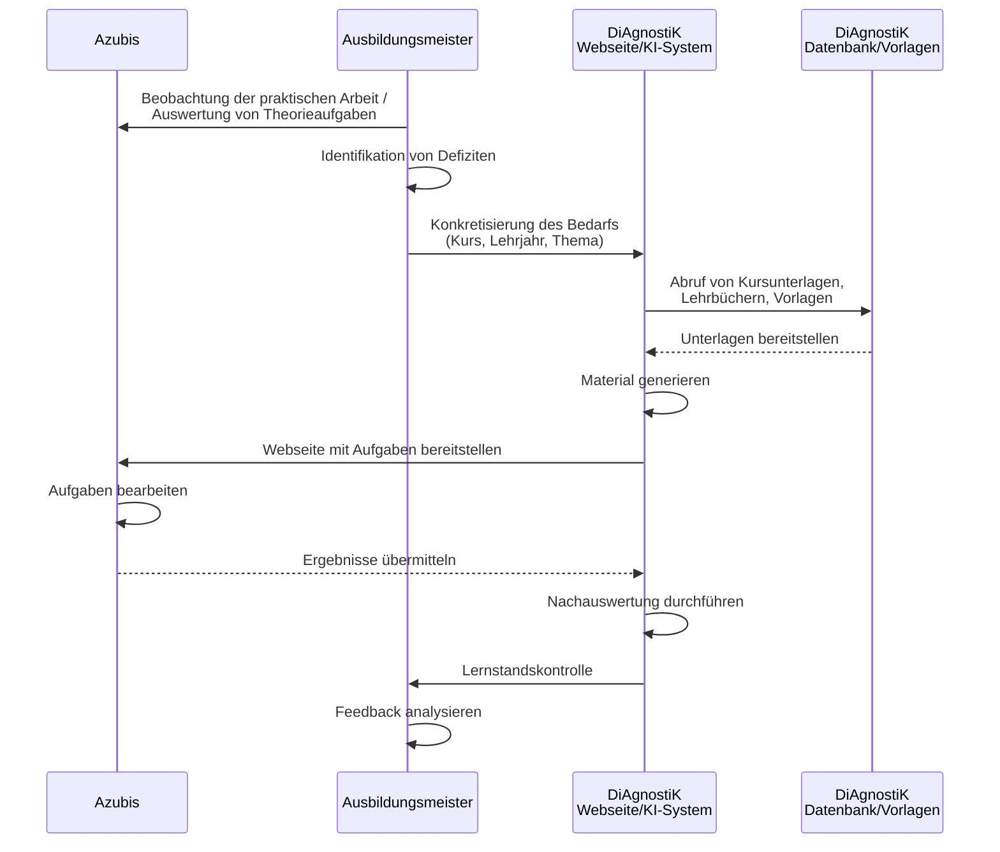

<!--
author: Sebastian Zug, Hilke Domsch, Volker Göhler, André Dietrich
version: 0.0.2
language: de
date: 2025-09-29
comment: Beiratssitzung des DiAgnostiK-Projekts am 29.09.2025
title: Beiratssitzung
tags: Vortrag, DiAgnostiK, Ifi
icon: https://raw.githubusercontent.com/Ifi-DiAgnostiK-Project/LiaScript-Courses/refs/heads/main/img/Logo_234px.png
import: https://raw.githubusercontent.com/liaScript/mermaid_template/master/README.md
        https://raw.githubusercontent.com/LiaTemplates/LiveEdit-Embeddings/refs/tags/0.0.1/README.md

@style
.flex-container {
    display: flex;
    flex-wrap: wrap; /* Allows the items to wrap as needed */
    align-items: stretch;
    gap: 20px; /* Adds both horizontal and vertical spacing between items */
}

.flex-child { 
    flex: 1;
    margin-right: 20px; /* Adds space between the columns */
}

@media (max-width: 600px) {
    .flex-child {
        flex: 100%; /* Makes the child divs take up the full width on slim devices */
        margin-right: 0; /* Removes the right margin */
    }
}
@end

-->

[](https://liascript.github.io/course/?https://raw.githubusercontent.com/LiaPlayground/Diagnostik_Zusammenfassung/refs/heads/main/README.md)

# Möglichkeiten und Grenzen von KI zur Generierung von Aufgaben

<section class="flex-container">

<!-- class="flex-child" style="min-width: 250px;" -->
> <h2>Stand der Arbeiten an der TU Bergakademie Freiberg</h2>
> 
> Prof. Dr. Sebastian Zug
> 
> Dr. André Dietrich
> 
> Volker Göhler
>
><h4>Beiratssitzung am 29.09.2025</h4>

<!-- class="flex-child" style="min-width: 250px;" -->


</section>

## Vision von DiAgnostiK

> __Unterstützung der ÜLU-Unterweisungen durch KI-generierte Aufgaben__

{{0-1}}


### Ausgangspunkt LiaScript

> LiaScript ist eine Beschreibungssprache für interaktive Lerninhalte, die auf Markdown basiert und durch spezielle Erweiterungen ergänzt wird.

```markdown @embed.style(height: 550px; min-width: 100%; border: 1px black solid)
# KIs mögen Textdateien

<!-- data-show="true" -->
| Fläche (Quadratmeter) | Kosten (Euro) |
|-----------------------|:-------------:|
| 1                     |           200 |
| 4                     |           500 |

Welche Kosten müssen Sie für 3 Quadratmeter veranschlagen?

[[ 400 ]] Euro
```

### Herausforderungen

1. __Heterogene digitale Vorkenntnisse bei Azubis und Lehrenden__

   <!-- width="700" -->

2. __Technische Randbedingungen während der ÜLU-Kurse__

3. __Konkretisierung der allgemeinen/fachpraktischen Inhalte__

4. __Qualität der Inhalte__

{{1-3}}
``` Prompt
  Erstelle eine LiaScript basiertes Quiz, das Aufgaben zur Arbeitszeitkalkulation
  für Auszubildende im Bereich Zahntechnik bereitstellt.
```
 
{{2-3}}
````Ausgabe
  ## Quizfragen
  
  ### Frage 1: Umrechnung
  
  Eine Mitarbeiterin benötigt für die Herstellung einer Krone **90 Minuten**.  
  Wie viele Stunden sind das?
  
  [( )] 1 Stunde
  [(X)] 1,5 Stunden
  [( )] 2 Stunden
````

{{2-3}}
Offenbar sind einfache Aufgaben gut realisierbar. Komplexere Aufgaben, die Kontextwissen erfordern, sind schwieriger.

## Lösungsstrategie

> Um die übergreifende Herausforderung der KI-gestützten Generierung von Aufgaben zu bewältigen, wird ein hybrider Ansatz verfolgt, der manuell erstellte Inhalte mit KI-generierten Materialien kombiniert.

| Herausforderung                                                   | Manuelle Erzeugung | KI-gestützte Erzeugung |
| ----------------------------------------------------------------- | ------------------ | ---------------------- |
| 1. **Heterogene digitale Vorkenntnisse bei Azubis und Lehrenden** | +++                | +                      |
| 2. **Technische Randbedingungen während der ÜLU-Kurse**           | ++                 | ++                     |
| 3. **Konkretisierung der allgemeinen/fachpraktischen Inhalte**    | +++                | +++                    |
| 4. **Qualitätssicherung**                                         | +++                | +                      |


Manuell erzeugte Inhalte
--------------------------

Beispiele für manuell erstellte Inhalte finden sich unter 

https://ifi-diagnostik-project.github.io/LiaScript-Courses/

> Gegenwärtig laufen erste Tests zur Einbindung und Evaluation von digitalen Materialien in die ÜLU-Kurse der HWK Dresden.  

KI-gestützte Erzeugung
--------------------------

1. Datenerfassung für die Kontextualisierung der Aufgabenstellung (abgeschlossen)
2. Entwurf eines dialoggeführten Systems zur Generierung der Aufgaben (in Arbeit)
3. Implementierung der Lernumbung mit generierten Materialien (geplant)

   ```
   🎓 Teaching-Agent aktiviert.
   Ich bleibe **streng in Charakter** und folge den BMAD-Bundle Instruktionen.
   
   👉 Folgende Aktionen stehen dir zur Verfügung:
   
   1. **create-outline** – Erste Vorlesungs-Outline erstellen (Titel, Zielgruppe, Abstract, Lernziele).
   2. **create-didactics** – Didaktik & Lehrstil entwickeln (auf Basis der Outline).
   3. **create-agenda** – Strukturierte Agenda mit Sessions bauen.
   4. **create-session {number} {type} {title?}** – Skeleton für eine Session anlegen.
   5. **promote-session {number} {type}** – Skeleton zu detailliertem Material erweitern.
   6. **validate-lecture** – Konsistenz und Vollständigkeit prüfen.
   7. **assemble-bundle** – Alles in ein fertiges Vorlesungspaket bündeln.
   8. **help** – Diese Übersicht anzeigen.
   9. **exit** – Persona verlassen.
   
   📌 Nächster Schritt gemäß den Instruktionen: **Immer zuerst eine Lecture Outline erstellen.**
   Dafür brauche ich von dir:
   
   * Titel der Vorlesung
   * Zielgruppe
   * Abstract (Themen, Inhalte, Nutzen)
   * 3–5 Lernziele
   * (Optional) Logo-Prompt
   
   👉 Möchtest du die Outline jetzt starten?
   ```

